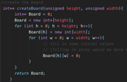
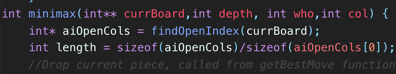
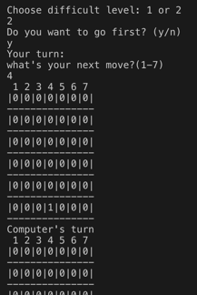
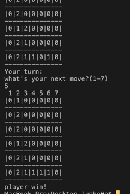

# connect-four

## implement the game “Connect 4” with AI.

## Connect 4 is a game similar to Tic-Tac-Toe. The main difference are it can only drop pieces from bottom of every column and it comes a win with 4 pieces connected. 

## Monte Carlo Tree Search implemented with random playing by AI itself, which may needs large size of memory, so I choose to use C++ which can work better with memory.

## Create a dynamic 2D array to store the board, it works well and efficiently in the following implementation.

## C++ part used a modified Monte Carlo Tree Search. Implemented a random play function which allows AI to play with itself. It will return the column index which get the maximum score accumulated in hundreds times playing. It is different from MCTs since MCTs checked all valid place while mine only check available index for every column. 

## Used the Minimax heuristi for the heuristic implementation c. It calculates scores for every valid move. When it is computer’s turn, it will return the column with max value, and for player’s turn it will return the column with minimum value.

## Used dynamic allocation of pointers, helps c++ to work much efficiently than python. With the same random play time, the AI’s reaction is faster with c++.

